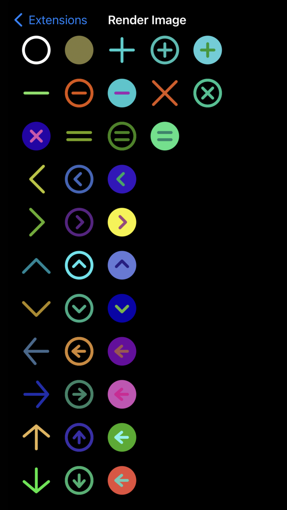

## 一: 通过`DSL`链式生成富文本
```swift
let str = "..."
let attr = str.jj.attributeMake({ make in
    make.for(...)....
    make.for(...)....
})
```

### 1.1 `Rangeable`协议
> Rangeable: 获取在给定字符串中的range(NSRange)

已经实现了`Rangeable`协议的有

a: `String`
```swift
make.for("春江")?.foregroundColor(.cyan)
```
b: `Int`
```swift
make.for(1)?.foregroundColor(.cyan)
```
c: `NSRange`
```swift
make.for(NSRange(location: 300, length: 201))?.foregroundColor(.red)
```
d: `CountableRange<Int>`
```swift
make.for(42..<45)?.foregroundColor(.green)
```
e: `CountableClosedRange<Int>`
```swift
make.for(72...82)?.foregroundColor(.green)
```
f: 自定义正则`JJAttributedRegexp`
```swift
let regex = JJAttributedRegexp(pattern: "人")!
make.for(regex)?.foregroundColor(.yellow)
```
### 1.2 范围实现`Rangeable`协议时越界问题。eg: `NSRange`、`CountableRange<Int>`、`CountableClosedRange<Int>`

```
给定的范围起始值lowerBound小于0的时候,会修正为从0开始
```
```
如果起始值加上范围长度后大于字符串最大长度的时候,会修正至字符串的最大长度,防止越界奔溃
```

## 二: `UIImage`拓展

### 2.1 生成颜色图片---通过`NSCache`缓存已经生成的纯色颜色图片
纯色图片
```swift
UIImage(color: .orange, size: CGSize(width: 100, height: 100), cornerRadius: 15)
```
线性颜色渐变图像
```swift
UIImage(linearColors: { size in
    return [
        (.blue, 0),
        (.green, 0.5),
        (.red, 1)
    ]
}, size: CGSize(width: 100, height: 100))
```
径向颜色渐变图像
```swift
UIImage(radialColors: { size in
    return [
        (.blue, 0),
        (.green, 0.5),
        (.red, 1)
    ]
}, size: CGSize(width: 100, height: 100))
```

### 2.1 绘制特定形状的图片---通过`NSCache`缓存已经生成的形状图片
```swift
UIImage.shape(.plus(4), size: 40, tintColor: .jRandom())
UIImage.shape(.plusCircle(4), size: 40, tintColor: .jRandom())
UIImage.shape(.plusCircleFill(4, .jRandom()), size: 40, tintColor: .jRandom())
```


### 2.2 滤镜

> `CoreImage`接受一个输入图像`inputImage: CIImage`,经过滤镜一系列的调制配方之后返回新的图像`outputImage: CIImage`

#### 2.2.1 所以我们可以封装一个统一的方法。此方法接受一个滤镜配方。
```swift
/// 操作滤镜生成逻辑
public typealias JJFilterAction = (_ inputImage: CIImage) -> CIImage

/// 使用CoreImage给图片添加滤镜
/// - Parameter filter: 操作滤镜生成逻辑
/// - Returns: 滤镜之后的UIImage
public func applyFilter(_ filter: UIImage.JJFilterAction) -> UIImage? {
    guard let inputImage = CIImage(image: base) else { return nil }
    let outputImage = filter(inputImage)
    guard let cgImage = UIImage.ciContext.createCGImage(outputImage, from: outputImage.extent) else {
        return nil
    }
    return UIImage(cgImage: cgImage)
}
```

#### 2.2.2 封装滤镜示例
```swift
 /// CIColorPosterize滤镜
static var colorPosterize: (_ inputLevle: Double) -> UIImage.JJFilterAction {
    return { inputLevle in
        guard let filter = CIFilter(name: "CIColorPosterize") else { fatalError() }
        let level = inputLevle > 30 ? 30 : (inputLevle < 2) ? 2 : inputLevle
        filter.setValue(level, forKey: "inputLevels")
        return { inputImage in
            filter.setValue(inputImage, forKey: kCIInputImageKey)
            guard let outputImage = filter.outputImage else { fatalError() }
            return outputImage
        }
    }
}
```

#### 2.2.3 使用示例
```swift
let img = self.originalImage.jj.applyFilter(UIImage.JJFilter.colorPosterize(20))
```